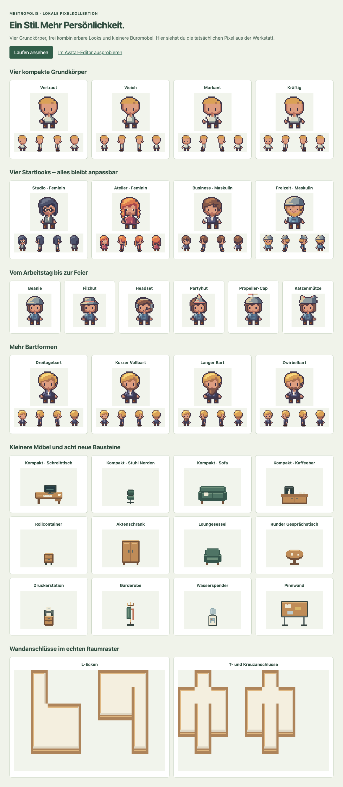

# Meetropolis Asset-Atelier — lokaler Prototyp

Drei begehbare Bürovorlagen mit eigenständig gesetzten Pixeln, drei Farb- und Materialrichtungen, 59 Bausteinen sowie modularen kompakten Figuren. Die Werkstatt verbindet die Vorschau, einen direkten Figurenvergleich, einen kleinen Pixeleditor und den Export. Es werden keine Bilder generiert oder fremde Bilddateien als Möbelvorlagen eingelesen.

Das Atelier läuft als eigenständiges Entwicklungswerkzeug aus diesem öffentlichen Repository. Der Startbefehl bindet an `127.0.0.1`; ein Backend, Zugangsdaten oder private Zusatzmodule sind dafür nicht erforderlich. Die Anwendung bietet einen lokalen Export und verändert keine produktiven Räume.



## Starten und prüfen

Voraussetzungen: ein Clone dieses Repositorys, Node.js 24 und npm 11.7 oder neuer. Der gemeinsame Sprite-Composer und sein Katalog liegen bereits unter `packages/shared/`. Die Abhängigkeiten des Ateliers werden separat installiert; eine Installation der Server- oder Webclient-Pakete ist zum Starten nicht nötig.

```sh
cd tools/asset-lab
npm ci
npm run dev
```

Anschließend `http://127.0.0.1:5188` öffnen. `http://127.0.0.1:5188/#figuren` führt direkt zum visuellen Avatar-Editor.

```sh
npm run lint
npm run format:check
npm run typecheck
npm test
npm run build
npm run assets
npm run assets:check
npm run e2e
```

Die Browserprüfung benötigt das zur installierten Playwright-Version gehörende Chromium. Falls es auf dem Rechner fehlt: `npx playwright install chromium`. Die Tests starten einen eigenen lokalen Server auf Port 5190; dieser Port muss frei sein. Während eines Browserlaufs keine Quelldateien ändern, da Vite die Testseite sonst neu lädt. `npm run assets` erzeugt je Palette 59 Asset-PNGs und ein `.mepack` sowie alle drei Büros als PNG und JSON unter `exports/`; Browseränderungen kommen über die Exportknöpfe aus der Werkstatt.

## Produktgeneration `atelier-v1`

Die erste Produktgeneration ist ein vorbereiteter, noch nicht aktivierter Bestand. `product/atelier-v1.json` friert „Licht und Holz“, die neue Pack-UUID und sechs vollständige Charakterrezepte ein. Die Ateliervarianten „Grünes Studio“ und „Abendatelier“ bleiben außerhalb der Produktartefakte. Weder Seed noch Karten, Packlisten, Avatar-Defaults oder Auswahlpfade lesen diese Dateien in dieser Stufe ein.

```sh
cd tools/asset-lab
npm ci
npm run assets:product
npm run assets:check
```

`npm run assets:product` erzeugt 59 inhaltsgehashte Umgebungs-PNGs unter `apps/web/public/assets/atelier/v1/holz/`, sechs inhaltsgehashte Spritesheets unter `apps/web/public/assets/sprites/atelier-v1/` und die abgeleiteten Katalog- und Manifestdateien. Der 32-Pixel-Boden wird darin als 2 × 2-Atlas für das 16-Pixel-Weltraster beschrieben. Richtungsansichten bleiben wegen ihrer unterschiedlichen Maße eigenständige, nicht drehbare Einträge. Die 48 Pixel hohen Wände tragen einen Pixelanker an der oberen Kante ihrer unteren Kollisionszeile und einen Versatz von 32 Pixeln nach oben. Das Wand-Autotile dokumentiert `gridHeight: 3`, bleibt aber bis zur stabilen Autotile-Identität aus A28 ausdrücklich zurückgehalten.

`npm run assets:check` erzeugt die Generation frisch in einem temporären Verzeichnis und vergleicht Pfade und Bytes mit dem eingecheckten Stand. Geänderte Bytes unter `atelier-v1` sind nicht zulässig; eine inhaltliche Änderung benötigt eine neue Generation mit neuen Pfaden und neuer Pack-UUID. Die rohen `.mepack`-Dateien aus `npm run assets` sind weiterhin reine Atelierausgaben und kein Importweg für diese Produktgeneration.

## Ausprobieren

1. „Team-Loft“, „Gartenstudio“ oder „Hofcampus“ wählen. Jede Karte zeigt den tatsächlichen Grundriss. „Figur gestalten“ öffnet den Live-Editor, „Büro betreten“ setzt die Figur an den Eingang und fokussiert die Raumsteuerung. Die Farbstimmung lässt sich zusätzlich unabhängig wählen. Ein Office-Wechsel setzt dessen Startpalette; Figur und gespeicherte Pixeländerungen bleiben erhalten.
2. In den Raum klicken oder tippen, um ein Laufziel zu setzen. Bei fokussiertem Raum funktionieren auch WASD und Pfeiltasten. Die Figur geht um Möbel und Innenwände herum. Die Kamera folgt ihr; „Ganzes Büro ansehen“ zeigt den gesamten Grundriss und unterstützt weiterhin Klick- und Touch-Ziele. „Raster & Kollisionen“ zeigt die Standflächen der Möbel und das 16-Pixel-Kartenraster.
3. Unter „Figur gestalten“ die Vorschauen für Haare, Gesicht, Kleidung oder Zubehör direkt anklicken. Farben und Figur ändern sich sofort. Sieben Startlooks, darunter zwei feminine und zwei maskuline Looks, und die animierte Raumprobe zeigen die Figur zusätzlich in ihrem gewählten Büro. Mit den Pfeilen alle Blickrichtungen prüfen; „Laufen“ schaltet die Animation um. Die Register lassen sich auch mit der Tastatur wechseln. Eine Kapuze verdeckt die Frisur und lässt sich direkt abnehmen.
4. „Frühere Entwürfe vergleichen“ öffnet die Gegenüberstellung mit „Rund“ und „Klassisch“. Die Beispiele „Mit Cap“, „Mit Kapuze“ und „Kupferrote Zöpfe“ sind weiter anpassbar und erhalten den gewählten Hautton. „Im Büro ausprobieren“ übernimmt eine Form in den Raum; „Vergleich als PNG“ sichert die Gegenüberstellung.
5. Unter „Die Bausteine“ ein Asset auswählen. Mit Stift oder Radierer direkt im Raster zeichnen. Ein Strich lässt sich zurücknehmen; „Asset zurücksetzen“ lässt sich ebenfalls rückgängig machen.
6. Änderungen werden im lokalen Browserspeicher erhalten. „Rezept speichern“ sichert sie als Datei; „Rezept öffnen“ stellt sie wieder her. Das Format `meetropolis-asset-lab/v2` speichert auch die Büroauswahl. Alte v1-Rezepte werden dem Team-Loft zugeordnet; Figur, Palette und Pixelkorrekturen bleiben unverändert. Ein gelöschter Browserspeicher kann nur aus einer zuvor gespeicherten Rezeptdatei wiederhergestellt werden.

## Quellen und Dateistruktur

| Datei                              | Aufgabe                                                                                          |
| ---------------------------------- | ------------------------------------------------------------------------------------------------ |
| `src/pixels.ts`                    | Rasterfläche mit festen RGBA-Pixeln, Rechtecken und pixelbasierten Silhouetten                   |
| `src/assets.ts`                    | Eigenständige Möbel-, Boden-, Wand- und Türvorlagen sowie drei Paletten                          |
| `src/avatar.ts`                    | Bestehender MIT-Composer und Katalog, ergänzt um drei lokale Gesichter und eine rote Bartpalette |
| `src/avatar-editor.ts`             | Visueller Editor mit echten Teilvorschauen, Farbauswahl und Tastaturbedienung                    |
| `src/avatar-compact.ts`            | Kompakte Stilprobe mit eigenen Haar-, Kleidungs- und Kapuzenrastern, Konturen und Paletten       |
| `src/avatar-proportions.ts`        | Neue Pixelraster für Kopf, Körper, Kleidung, Frisuren und Accessoires der Körperformen           |
| `src/avatar-comparison.ts`         | Synchron animierter Vergleich, Büroausschnitte und gemeinsamer PNG-Export                        |
| `src/office-compact.ts`            | Kleine Möbelfamilie mit Richtungsansichten und acht zusätzlichen Möbeltypen                      |
| `src/avatar-accessories.ts`        | Sechs zusätzliche Kopfbedeckungen und vier Bartformen                                            |
| `src/office-art.ts`                | Eigene Richtungsansichten, Wandatlas, offene Tür und Pflanzen-/Sitzbausteine                     |
| `src/office-model.ts`              | Gemeinsamer Vertrag für Weltgröße, Plätze, Wände, Zonen und Einstieg                             |
| `src/office-presets.ts`            | Drei vollständige Grundrisse mit 6, 12 und 24 erreichbaren Arbeitsplätzen                        |
| `src/office-picker.ts`             | Visuelle Büroauswahl und Einstieg mit Tastatur- und Touch-Bedienung                              |
| `src/world.ts`                     | Gemeinsame Raumzeichnung, Kollisionsflächen, semantische Zonen und Wegsuche                      |
| `src/scene.ts`                     | Begehbare Phaser-Vorschau mit Tiefensortierung und vier Laufrichtungen                           |
| `src/draft.ts`                     | Rezeptformat, Prüfung eingelesener Daten und manuelle Pixeländerungen je Stil                    |
| `src/pack.ts`                      | Metadaten und Export im vorhandenen `.mepack`-Format                                             |
| `src/main.ts`                      | Bedienoberfläche, Pixeleditor, Speicherung und Downloads                                         |
| `scripts/export-assets.ts`         | Deterministischer Export aller Grundvarianten für Arbeit per CLI                                 |
| `product/atelier-v1.json`          | Feste Produktentscheidungen, Pack-UUID und sechs vollständige Charakterrezepte                   |
| `scripts/product-assets.ts`        | Umsetzungsschicht für Hashpfade, Raster, Maße, Kollision, Ebenen und Wandanker                   |
| `scripts/export-product-assets.ts` | Schreib- und Prüfkommando für die unveränderliche Produktgeneration                              |
| `tests/`                           | Pixel-/Rezept-/Pack-Prüfungen und echte Browsertests einschließlich Touch                        |

Menschen und Coding-Agenten verwenden dieselben Quellen. Agenten verändern Pixelvorlagen in `assets.ts`, `office-art.ts` und `office-compact.ts`, Figurenraster in `avatar-accessories.ts`, `avatar-compact.ts`, `avatar-proportions.ts` beziehungsweise `avatar.ts` und Raumplatzierungen in `office-presets.ts`. Manuelle Möbelkorrekturen werden im Rezept als Pixelposition und Farbe beziehungsweise Transparenz gespeichert. Vorschau und PNG-Export verwenden dieselben RGBA-Daten; es gibt keinen separaten Nachbau für den Export.

Der gemeinsame Charakterkatalog wird für lokale Ergänzungen geklont. Die Dateien in `packages/shared/` bleiben unverändert. Das Atelier, seine eigenen Pixelvorlagen und die daraus exportierten eigenen Assets stehen unter [MIT](LICENSE). Der vollständige Entwurfsexport enthält den Lizenztext des Ateliers sowie die MIT-Lizenz und Herkunftshinweise des gemeinsamen Charakterkatalogs. Der CLI-Export legt `LICENSE.txt` neben die Packs. Beim Weitergeben einzelner PNGs oder Packs diese Lizenzhinweise beilegen. Markenrechte am Namen Meetropolis sind davon getrennt; siehe [TRADEMARKS.md](../../TRADEMARKS.md).

## Export und Integrationsgrenzen

„Entwurf exportieren“ erzeugt ein lokales ZIP mit 59 einzelnen PNGs, dem Charakter-Spritesheet, einer Raumvorschau, dem wieder einlesbaren Atelier-Rezept, einem Raumrezept, Herkunftshinweisen und einem `.mepack`.

Das innere `.mepack` enthält ausschließlich `config.json` und `assets/*.png`. Die automatisierten Prüfungen verwenden das tatsächliche Schema aus `apps/server/src/api/routes/assetPacks.schemas.ts` und prüfen die PNG-Daten nach dem ZIP-Rundlauf. Ein Import in den produktiven Server wurde nicht durchgeführt. Die Zod-Abhängigkeit des Schematests wird lokal aufgelöst; dafür müssen keine Serverpakete installiert oder Anwendungsdateien verändert werden.

Jedes Möbel bringt vorkonfigurierte Kollisionsvorgaben mit. `collisionBaseRows` in `assets.ts` zählt die unteren Kachelzeilen am 16-Pixel-Raster; das Pack überträgt diese Zahl als `collisionBaseHeight`. Die neuen kompakten Möbel belegen jeweils eine untere Kachelzeile. Ihr Bildraster ist vollständig auf Kacheln ausgerichtet; der sichtbare 16 × 24-Pixel-Stuhl sitzt beispielsweise unten in einer 16 × 32-Pixel-Fläche. Die größeren bisherigen Schreibtische, Sofas und Besprechungstische behalten zwei Kollisionszeilen und ihre bisherigen Pixelkoordinaten. Breite und Gesamthöhe werden auf ganze Kacheln aufgerundet. Die Raumvorschau zeigt dieselben Flächen; die Tests vergleichen sie für alle Bausteine mit der tatsächlichen Serverfunktion `computeFootprintTiles`, auch über Chunk-Grenzen hinweg. Die Ausgabe enthält außerdem Kollisionsaktivierung, Darstellungsreihenfolge, Boden-/Wandplatzierung, Skalierung und erlaubte Transformationen. Ein einzelner PNG-Download enthält diese Vorgaben nicht.

Bei durchgehbaren Assets wird `collide: false` exportiert. Das ist notwendig, weil der Server den Wert `collisionBaseHeight: 0` bei einem kollidierenden Objekt als volle Fläche interpretiert. Beim Bearbeiten von Farben und einzelnen Pixeln bleiben die vorbereiteten Kollisionsvorgaben erhalten.

Alle drei Vorlagen verwenden die bestätigte kleine Möbelfamilie: Schreibtische 48 × 32 Pixel, sichtbare Stühle 16 × 24 Pixel und entsprechend neu gezeichnete Sofas, Tische, Regale, Kaffeebars und weitere Ausstattung. Die 29 neuen Bausteine besitzen eigene IDs, damit Pixelkorrekturen an den 30 bisherigen Assets unverändert erhalten bleiben. Bisherige große Möbel bleiben im Bausteinkatalog editierbar; die neuen Standardgrundrisse verwenden die kompakten Varianten. Neue Möbeltypen sind Rollcontainer, Aktenschrank, Loungesessel, runder Gesprächstisch, Druckerstation, Garderobe, Wasserspender und Pinnwand.

Die Kollektion lässt sich unter `http://127.0.0.1:5188/design/compact-collection.html` mit allen Blickrichtungen und Laufanimation prüfen. `design/detail-study.html` zeigt den direkten Größenvergleich.

Die drei Vorlagen haben eigene Raumgrößen, Möbelanordnungen, Einstiegspunkte und Zonen:

| Vorlage      | Weltgröße in Pixeln | Arbeitsplätze | Raumaufteilung                                                                         |
| ------------ | ------------------- | ------------- | -------------------------------------------------------------------------------------- |
| Team-Loft    | 960 × 672           | 6             | Vier Teamplätze, zwei Fokusplätze, Lounge, Kaffee, Besprechung mit vier Stühlen        |
| Gartenstudio | 1120 × 768          | 12            | Zwei Teamfelder, Fokus-/Atelierbereich, grüne Mitte, Besprechung mit sechs Stühlen     |
| Hofcampus    | 1440 × 896          | 24            | Drei Teamflügel mit je acht Plätzen, Hof, Rückzug, Café, Besprechung mit sechs Stühlen |

Schreibtisch, Bürostuhl und Sofa besitzen vier eigenständig gezeichnete Ansichten. Das Pack verknüpft sie über `directionalImages`; zusätzlich bleiben die einzelnen Ansichten editierbare Bausteine. Die Tests lesen jede Richtungs-PNG tatsächlich aus dem ZIP und vergleichen ihre Pixel. Die Grundrisse verwenden ausgerichtete Arbeits- und Besprechungsstühle. Jede Arbeitsplatz- und Sitzgruppe wird auf freie Zugänge geprüft.

Innenwände verwenden einen vollständigen 4-bit-Atlas: 16 Masken, vier Spalten, 16 × 48 Pixel je Bild, N=1/E=2/S=4/W=8. Eine platzierte Wandzelle blockiert lokal eine 16 × 16-Pixel-Kachel; die oberen 32 Pixel bilden ihre sichtbare Höhe. Vorschau und Exportzeichnung verwenden dieselben Anschlussmasken. Die offene Tür ist passierbar und hat keine Öffnungsanimation.

Das Raumrezept `meetropolis-office-study/v2` ist ein lokaler Entwurf und noch kein TMJ-/Importformat des produktiven Map-Editors. Gesprächszonen besitzen hier keine Audiofunktion. Die produktive Anmeldung wählt weiterhin ihre vorhandene Default-Map; diese Anwendung verändert sie nicht.

Der Pack-Schematest bestätigt das vorhandene Importformat, keine vollständige Laufzeitintegration. Insbesondere verwendet der aktuelle produktive `AutotileRenderer` einen festen Bildanker und eine feste Tiefe; die Registrierung übernimmt die Atlas-Höhe nicht als Ankervertrag. Die 48 Pixel hohen Wandbilder brauchen deshalb eine geprüfte Anbindung an diesen Renderer. Auch die Platzierung und Kollision beim produktiven Drehen von Richtungsbildern muss dort noch als Gesamtablauf abgenommen werden. Die hier geprüften Standflächen beziehen sich auf die einzelnen Ansichten und die lokale Raumvorschau.

Die Figur verwendet das bestehende Format: 32 × 32 Pixel je Frame, 128 × 256 Pixel je Sheet, vier Idle-Richtungen und vier Laufbilder je Richtung bei 8 Bildern pro Sekunde. Rechts wird aus links gespiegelt. Die Formen entstehen aus eigenen Farbschlüsselrastern für alle Körper- und Zubehörteile; sie werden nicht aus einem fertigen Bild skaliert. Der bestehende Composer setzt diese Ebenen und Animationen zusammen.

Neue Entwürfe beginnen mit „Kompakt“. Hinzu kommen „Kompakt · Weich“, „Kompakt · Markant“ und „Kompakt · Kräftig“: eigene Kinn-, Schulter- und Körperkonturen im selben Stil. Die sieben Startlooks sind Vorschläge; jede Körperform lässt sich unabhängig mit Haut, Frisur, Bart, Hut und Kleidung kombinieren. Der Kinn-/Halsübergang liegt auf der Kopfebene; Oberteile lassen die mittigen Halspixel frei. Zusätzlich auswählbar sind Dreitagebart, kurzer Vollbart, langer Bart und Zwirbelbart sowie Beanie, Filzhut, Headset, Partyhut, Propeller-Cap und Katzenmütze. Die Stilprobe kombiniert große Haarflächen, ein kleines sichtbares Gesicht, kurze Beine und eine dunkle Kontur mit eigenen abgestimmten Paletten. Brillen und Bärte haben eigene Raster an den Augen- und Mundpositionen dieser Figur. Die neuen Hüte und Bärte werden bei den älteren Körperformen an Kopfbreite, Stirn und Mundanker angepasst. Die Gesichtsebene hält den Mund auch dort über dem Bart lesbar. Zöpfe besitzen eine geteilte Rückansicht statt einer Fläche wie offene Haare. Die Kapuze und die Oberteile haben eigene Pixelraster; Anzug, Hoodie und Kleid unterscheiden sich auch in ihrer Zeichnung. Die Haarfarbfelder zeigen die jeweils aktive Palette. Es werden keine externen Referenzbilder eingelesen oder mitgeliefert. Die Auswahl wird als optionales `character.proportion` im Atelier-Rezept gespeichert. Vorhandene Rezepte ohne dieses Feld verwenden weiterhin die ursprüngliche Körperform; sie ist auch als „Bisheriger Stand“ auswählbar und im Vergleich aufklappbar. Gespeicherte Entwürfe mit „Rund“, „Klassisch“ oder „Schlank“ behalten ebenfalls ihre bisherigen Formen und Farben. Die lokale Körperform, Gesichtsauswahl und rote Bartpalette sind noch nicht in die produktive Avatar-API aufgenommen. Der Prototyp enthält keine Sitz-/Arbeitsanimation und keinen Mehrbenutzertest.

Die drei Stilrichtungen sind Palettevarianten eines gemeinsamen Formensatzes. Änderungen an den Pixelvorlagen lassen sich in der Kollektion und in den begehbaren Räumen direkt vergleichen.

Der lokale Build enthält die vollständige Phaser-Bibliothek und meldet deshalb eine Chunk-Größenwarnung. Die gemessene JavaScript-Ausgabe liegt bei etwa 1,73 MB beziehungsweise 433 KB mit gzip. Die endgültige Einbindung in den bestehenden Webclient und dessen Ladezeitprüfung sind ein eigener Integrationsschritt.
